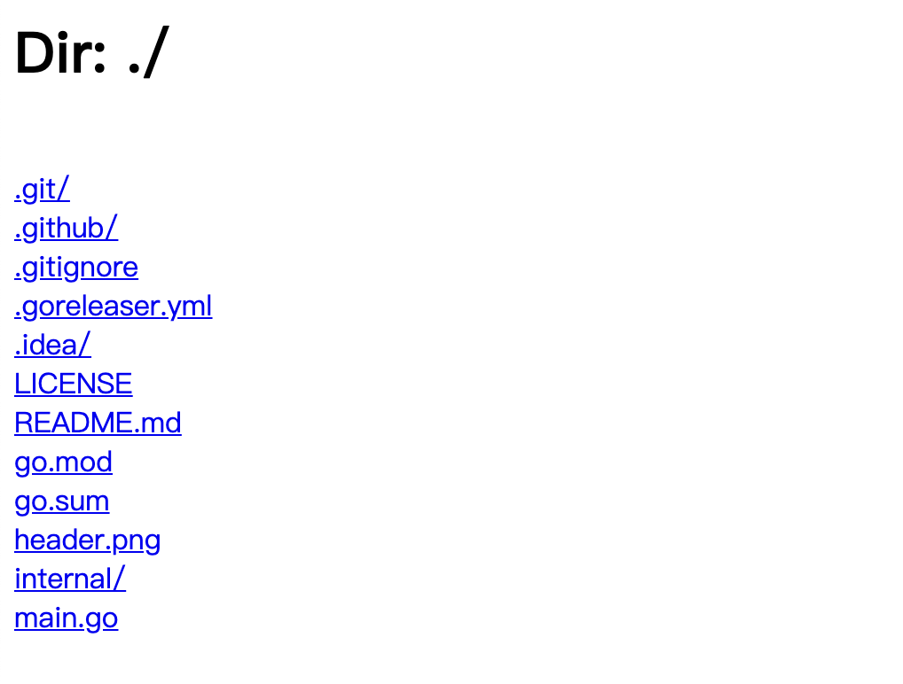

# serve

[](https://codecov.io/gh/chyroc/serve)
[](https://goreportcard.com/report/github.com/chyroc/serve)
[](https://github.com/chyroc/serve/actions)
[](https://opensource.org/licenses/Apache-2.0)
[](https://pkg.go.dev/github.com/chyroc/serve)
[](https://badge.fury.io/go/github.com%2Fchyroc%2Fserve)


## Features

- Support access to static files and folders
- Support random port selection
- Local logging

## Install

```shell
brew install chyroc/tap/serve
```

```shell
go instll github.com/chyroc/serve@latest
```

## Usage

```shell
serve
```

|  |  |
| --- | --- |
| </a> | </a> | 
| </a> | </a> | 
